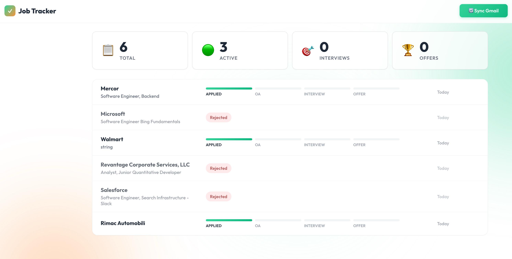
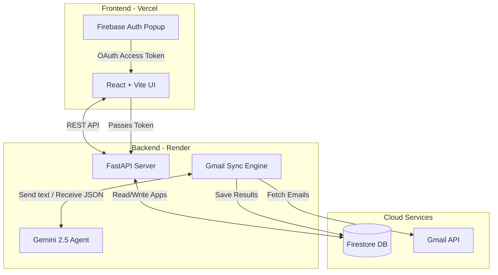

<div align="center">
  <h1>🚀 JobSync: Agentic Job Application Tracker</h1>
  <p><strong>AI-powered dashboard that reads your Gmail, classifies emails with Gemini 2.5, and automatically tracks your job hunt progress.</strong></p>
  
  [](https://ai-job-tracker-black.vercel.app)
</div>

<br />

<div align="center">
  
</div>

<br />

## ✨ Features

- **Automated Gmail Syncing**: Simply sign in with Google, and the system uses the Gmail API (and History API for incremental syncs) to automatically find job-related emails.
- **Agentic AI Classification**: Powered by **Google Gemini 2.5 Flash**, every email is intelligently parsed to extract the Company, Role, and current Pipeline Status (Applied → OA → Interview → Offer → Rejected).
- **Beautiful Dashboard**: A premium, minimalist interface built in React + Vite, featuring dynamic gradient backgrounds, modern 'Outfit' typography, and a clean tabular layout.
- **Smart Analytics**: Instantly see your Total Applications, Active processes, Interview count, and Offers.
- **Manual Overrides**: AI made a mistake? Click any job to open the Timeline drawer and manually edit the company name, role, or status.
- **Zero-Friction Auto-Sync**: Automatically checks for new emails in the background if it's been more than 12 hours since your last sync.

## 🏗 System Architecture

The application is split into a React frontend deployed on Vercel and a FastAPI Python backend deployed on Render. They communicate securely using Firebase Authentication and Firestore.



## 🛠 Tech Stack

| Component | Technology |
|---|---|
| **Frontend Framework** | React 18 + Vite |
| **Styling** | Vanilla CSS (CSS Variables, Flexbox, Animations) |
| **Backend Framework** | FastAPI (Python 3.11) |
| **Authentication** | Firebase Auth (Google Provider) |
| **Database** | Google Firestore |
| **AI Model** | Google Gemini 2.5 Flash (`gemini-2.5-flash`) |
| **Deployment** | Vercel (Frontend) + Render (Backend) |

## 🚀 Local Development Setup

### 1. Prerequisites
- Node.js 18+
- Python 3.11+
- A Google Cloud Project with the **Gmail API** enabled.
- A Firebase Project with **Firestore** and **Google Authentication** enabled.
- A Gemini API Key from Google AI Studio.

### 2. Backend Setup
```bash
cd backend
python -m venv venv
source venv/bin/activate
pip install -r requirements.txt
```
Create a `.env` file in the `backend/` directory:
```env
GEMINI_API_KEY=your_key
FIREBASE_PROJECT_ID=your_firebase_project_id
```
Place your Firebase Service Account JSON file at `backend/firebase-sa.json`.

Run the server:
```bash
uvicorn app.main:app --reload --port 8000
```

### 3. Frontend Setup
```bash
cd frontend
npm install
```
Create a `.env.local` file in the `frontend/` directory:
```env
VITE_FIREBASE_API_KEY=your_firebase_api_key
VITE_FIREBASE_AUTH_DOMAIN=your_project.firebaseapp.com
VITE_FIREBASE_PROJECT_ID=your_project_id
VITE_BACKEND_URL=http://localhost:8000
```
Run the frontend:
```bash
npm run dev
```

## 🌍 Production Deployment

This project is configured for continuous deployment from GitHub.

1. **Backend (Render)**:
   - Create a new "Blueprint" in Render and connect your GitHub repo. It will automatically detect `render.yaml`.
   - In the Render Dashboard, add your Environment Variables (`GEMINI_API_KEY`, `FIREBASE_PROJECT_ID`, and `ALLOWED_ORIGINS=*`).
   - Add your `FIREBASE_SERVICE_ACCOUNT_JSON` as a raw JSON string in the Environment Variables.
2. **Frontend (Vercel)**:
   - Create a new project in Vercel and connect your repo.
   - Add your `VITE_FIREBASE_*` environment variables.
   - Set `VITE_BACKEND_URL` to your live Render URL.
   - Vercel will automatically build the React app and configure the SPA routing using the included `vercel.json`.

---
*Built to make the job hunt slightly less painful.*
